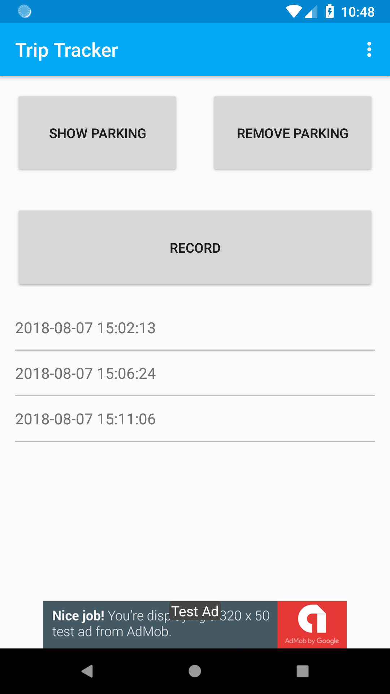

# Trip Tracker

## Overview

[Google Play Link](https://play.google.com/store/apps/details?id=eu.wonderfulme.triptracker)

## How to build the code in debug?
To successfully build TripTracker in debug mode:
1. Copy fabric.properties and google-services.json under the app Module. Both fabric apiSecret and apiKey must be within fabric.properties file.
2. Add related passwords to gradle.properties such as GOOGLE_MAPS_API_KEY and etc.
3. Remove unnecessary release signing keys and config from gradle if needed. 
3. Do NOT forget to add test admob ids to the strings.xml if real ones are still in use.

## ScreenShots
|    |   |   |   |
| ------------- | ------------- | ------------- | ------------- |
|  |   |  |  |
|  | | | |

## Third-party libraries
* [OpenCSV](http://opencsv.sourceforge.net/)
* [ButterKnife](https://github.com/JakeWharton/butterknife)
